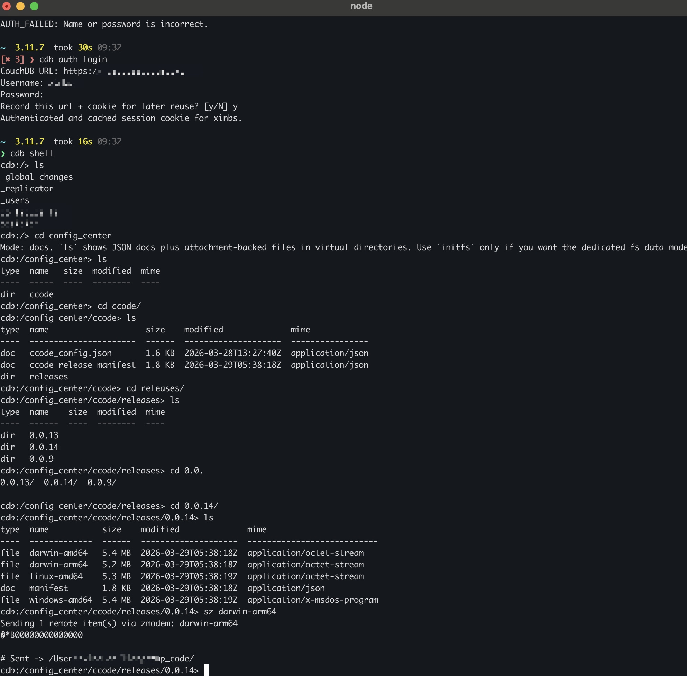

# couchdb-cli

一个把 CouchDB 用成“像文件系统一样可操作”的 CLI。

它的核心目标不是只做底层 API 包装，而是把 CouchDB 变成一种更自然的日常工作界面：

- 对人来说：
  可以像操作文件、目录一样浏览和管理数据库内容
- 对 AI 来说：
  可以用稳定的命令式接口和 `--json` 输出做自动化调用

## 项目特点

### 1. 交互模式不是普通数据库控制台，而是“远程文件式 shell”

进入 shell 后，你可以直接这样操作：

```text
ls
cd config_center
cd ccode
ls
vi ccode_config.json
cp ./local.txt note.txt
cp releases
pull releases ./downloaded
```

实际交互效果：



也就是说，你不是在背 CouchDB API，而是在用接近文件管理器的方式操作数据库内容。

### 2. 普通 CouchDB 文档库也能像目录树一样浏览

对于已有业务库，不要求你先迁移数据模型。

文档 ID 例如：

```text
ccode/releases/0.0.9/manifest
ccode/releases/0.0.9/linux-amd64
```

在 shell 里会被看成：

```text
/ccode/releases/0.0.9/manifest
/ccode/releases/0.0.9/linux-amd64
```

所以：

- `cd` 是进“虚拟目录”
- `ls` 是看当前层级
- `cat` / `vi` 是读写当前对象

### 3. 既支持普通文档库，也支持专用文件库

- `docs` 模式：
  直接面向现有 CouchDB 业务库，JSON 文档和附件都能操作
- `fs` 模式：
  把数据库初始化成真正的远程文件树，适合专用文件存储

这意味着它既适合：

- 配置中心
- 发布清单库
- 业务文档库

也适合：

- 专门的远程文件仓库
- 备份库
- 资产库

### 4. 本地和远程可以放在同一个交互界面里

shell 里同时有：

- 远程命令：
  `ls`、`cd`、`cat`、`vi`、`cp`、`push`、`pull`
- 本地命令：
  `lpwd`、`lcd`、`lls`、`lcp`

这让你在“本地文件”和“远程 CouchDB 内容”之间切换时，不用跳出上下文。

这里的 `cp` 会自动判断方向：

- `cp ./a.txt`
  本地到远程
- `cp note.txt`
  远程到本地
- `cp ./dir`
  本地目录到远程
- `cp releases`
  远程目录到本地

### 5. 适合人，也适合 AI

对人：

- 交互 shell 更接近文件系统心智模型
- 支持 `vi/vim`
- 支持 Tab 补全
- 支持 `rz/sz`

对 AI：

- 所有命令都可以命令式调用
- 支持稳定 `--json` 输出
- 适合脚本、Agent、CI、自动化流程

### 6. 跨平台，安装方式简单

- 基于 Node.js
- Linux / macOS / Windows 都能跑
- 可以 `npm i -g`
- 也可以 `npx` 临时试用

## 使用方式

它同时支持两种使用方式：

- 命令式 CLI
- 交互式 shell

它同时支持两类数据库语义：

- `docs` 模式
  把普通 CouchDB 文档库按“虚拟目录 + 文档/附件文件”的方式来操作
- `fs` 模式
  把数据库初始化成专用文件树，目录和文件语义更强

## 详细文档

- [文档总览](./docs/README.md)
- [模式说明：root / docs / fs](./docs/modes.md)
- [交互式 shell 详细用法](./docs/shell.md)
- [命令式 CLI 详细用法](./docs/cli.md)
- [AI / 自动化调用说明](./docs/ai-automation.md)

## 安装

全局安装：

```bash
npm i -g @xinbs/couchdb-cli
```

临时试用：

```bash
npx @xinbs/couchdb-cli --help
```

本地开发：

```bash
npm install
npm run build
node dist/index.js --help
```

## 安全

不要把真实的 `.env` 提交到 Git。

仓库已经忽略：

- `.env`
- `.env.*`

保留一个安全示例文件：

- `.env.example`

## 环境变量

支持这些环境变量：

```bash
COUCH_URL=https://your-couchdb-host:5984
COUCH_USER=admin
COUCH_PASSWORD=secret
# COUCH_DB=mydb
COUCH_TIMEOUT=20000
```

如果你习惯用 `.env`：

```bash
set -a; source ./.env; set +a
```

## 连接方式

### 1. 直接命令行传参

```bash
cdb --url "https://host:5984" --user admin --password secret db list
```

### 2. 环境变量

```bash
set -a; source ./.env; set +a
cdb db list
```

### 3. 交互式登录

```bash
cdb auth login
```

交互式登录会依次提示：

- CouchDB URL
- Username
- Password
- 是否记录当前 `url + cookie`

默认行为：

- 不保存用户名
- 不保存密码
- 不保存 cookie

如果你在最后一步选择 `y`，只会记录当前 `url + cookie`。

## Profile

Profile 用来切换不同地址、账号、默认数据库。

新增一个 profile：

```bash
cdb profile add prod --url "https://host:5984" --user admin --db mydb --current
```

查看和切换：

```bash
cdb profile list
cdb profile current
cdb profile use prod
```

## 快速开始

### 创建数据库

```bash
cdb db create mydb
```

### 进入交互 shell

```bash
cdb --db mydb shell
```

如果没有提供连接信息，shell 会在启动时提示输入。

## Shell 心智模型

shell 有 3 种位置语义：

- `cdb:/>`
  服务器根目录，`ls` 显示数据库列表
- `cdb:/mydb>`
  数据库根目录
- `cdb:/mydb/path>`
  数据库内部路径

### 根目录

在根目录下：

- `ls` 列数据库
- `mkdir testdb` 或 `mkdb testdb` 创建数据库
- `rm testdb` 删除数据库，会二次确认
- `cd testdb` 进入数据库

### docs 模式

普通 CouchDB 数据库默认是 `docs` 模式。

这个模式下：

- 文档 ID 会按 `/` 展示成虚拟目录
- JSON 文档显示为 `doc`
- 带 attachment 的文档显示为 `file`
- 空目录会通过隐藏目录标记文档保存

也就是说，像这种文档 ID：

```text
ccode/releases/0.0.9/manifest
ccode/releases/0.0.9/linux-amd64
```

在 shell 里会看起来像：

```text
/ccode/releases/0.0.9/manifest
/ccode/releases/0.0.9/linux-amd64
```

### fs 模式

如果你希望数据库是“专用文件树”，先初始化：

```bash
cdb --db mydb fs init
```

或者在 shell 里：

```text
initfs
```

`fs` 模式会使用专门的数据模型来保存目录和文件。

## Shell 常用命令

### 远程命令

```text
ls
cd <path>
pwd
mode
mkdir <path>
cat <path>
vi <path>
vim <path>
put <local> [remote]
cp <local> [remote]
get <remote> [local]
push <localDir> [remote]
pull [remote] <localDir>
rz [options] [remote]
sz [options] <remote>
rm [-r] <path>
```

### 本地命令

本地命令统一加 `l` 前缀：

```text
lpwd
lcd ~/Downloads
lls -la
lcp a.txt b.txt
lmkdir tmp
```

本地路径会相对于 `lcd` 维护的本地工作目录解析。

## docs 模式下支持什么

现在普通文档库里也支持这些“像文件一样”的命令：

- `ls`
- `cd`
- `mkdir`
- `cat`
- `vi` / `vim`
- `put` / `cp`
- `get`
- `push`
- `pull`
- `rz`
- `sz`
- `rm`

规则是：

- 本地 JSON 文件上传时，优先写成 JSON 文档
- 非 JSON 文件上传时，写成 attachment-backed file
- `cat` / `vim` 对文本 attachment 可直接工作
- 二进制内容请用 `get` 或 `sz`

## 示例

### 1. 在 docs 模式里像文件一样操作

```text
cdb shell
cd config_center
cd ccode
ls
cd releases
cd 0.0.14
ls
cat manifest
sz -bey linux-amd64
```

### 2. 在 fs 模式里上传和下载

```text
cdb shell
mkdir myfiles
cd myfiles
initfs
mkdir notes
cd notes
lcd ~/Downloads
cp ./hello.txt
ls
get hello.txt ./hello.txt
```

### 3. 上传整个本地目录

```text
lcd ~/project-assets
push ./bundle assets
```

### 4. zmodem 上传到当前远程目录

```text
rz -bey
```

或者指定远程目标：

```text
rz -bey /test/uploads
```

### 5. zmodem 下载远程文件

```text
sz -bey manifest
sz -bey linux-amd64
```

## 命令式 CLI 示例

数据库：

```bash
cdb db list
cdb db create mydb
cdb --yes db delete mydb
```

文档：

```bash
cdb --db config_center doc get "ccode/ccode_config.json"
cdb --db config_center doc put mydoc --data '{"hello":"world"}'
```

附件：

```bash
cdb --db config_center attach list "ccode/releases/0.0.14/linux-amd64"
cdb --db config_center attach get "ccode/releases/0.0.14/linux-amd64" linux-amd64 ./linux-amd64
```

fs：

```bash
cdb --db myfiles fs init
cdb --db myfiles fs put ./hello.txt /hello.txt
cdb --db myfiles fs get /hello.txt ./hello.txt
```

## 输出模式

默认输出更适合人看。

如果你要给 AI 或脚本调用，用 `--json`：

```bash
cdb --db mydb fs ls / --json
```

## 测试

本地开发常用：

```bash
npm run typecheck
npm run build
npm test
```

如果要跑真实 CouchDB 集成测试，先提供：

```bash
COUCH_URL=...
COUCH_USER=...
COUCH_PASSWORD=...
```

然后执行：

```bash
npm run test:integration
```
